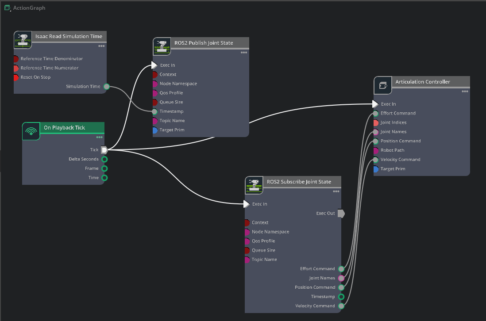

# SO-101 Robot Arm Teleoperation Guide

**Versions**
- Ubuntu 24.04
- IsaacSim 5.0.0
- ROS2 Jazzy

## Launch Isaac Sim With Ros2

- conda activate env_isaacsim
- cd ~/ASGARD-embodied-AI-home-robot/sim
- ./launch_isaacsim.bash
- Click File > Open so101_teleop/so101.usd
- Click Play on the left panel

## ROS2 Terminal

- In another terminal: source /opt/ros/jazzy/setup.bash
- cd ~/ASGARD-embodied-AI-home-robot/sim/so101_teleop
- python3 keyboard_control.py
- Follow instructions to control arm

## Action Graph

- References: 
    - https://wiki.seeedstudio.com/lerobot_so100m_isaacsim/ 
    - https://github.com/qdeyna/SO-ARM_MoveIt_IsaacSim/tree/main

## Robot is bouncy or not stiff

- Adjust joint physics parameters in Isaac Sim
- Select each joint in the Stage panel
- Under **Drive**, set:
  - **Stiffness**: 20000
  - **Damping**: 2000
  - **Max Force**: 10000